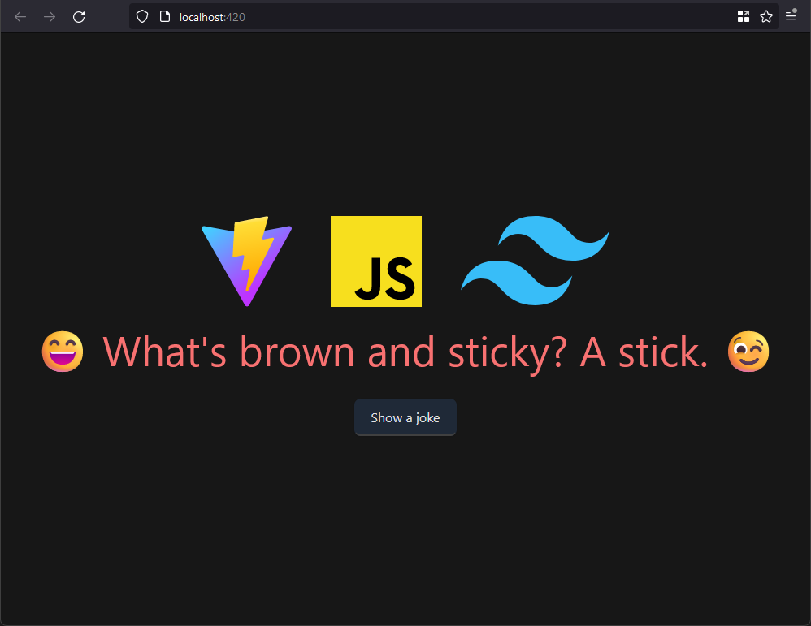

# @opinion/vite-base

## Choose a version
 - [@opinion/vite-base](https://github.com/Opinion/vite-base)
 - [@opinion/vite-base#tailwindcss](https://github.com/Opinion/vite-base/tree/tailwindcss)

## Wha'du heck is this?
My biggest gripe with vite is that it doesn't use `./src` out of the box. vite-base is a configured vanilla javascript vite installation without any frameworks. Perfect for simple projects. Download and start working.

## Features
 - Vite configured for vanilla Javascript
 - (Optional) Configured with TailwindCSS
 - Code moved to `./src`
   * Javascript files in `./src/js`
   * Public/asset files in `./src/static`
   * CSS files in `./src/styles`
 - Added `.env.development`
 - Added `.env.production`
 - Asynchronous `vite.config.js` ready for modification
   * Added `isProduction` check
   * Added `.env` loading based on current mode

## Preview

## Get started
 1. Download
 2. `npm install`
 3. `npm run dev`

Consider uncommenting `#.env.development` and `#.env.production` from `.gitignore` if you are going to tell it all your dirty secrets and passwords 🐸.
